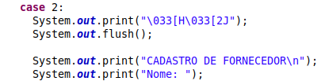
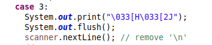
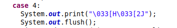
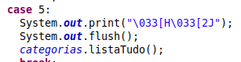
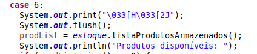
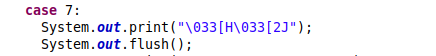

# TP2_SistemaEstoque

O TP2 consiste em realizar uma análise sobre o código, com base em boas características de um bom projeto de software, observar os maus-cheiros presentes no sistema e aplicar a operação de refatoração capaz de levar o projeto de código a ter a característica analisada.

## Integrantes 

| Discente | Matrícula |
|--------- | --------- |
| Leonardo Milomes Vitoriano | 201000379 |

## Característica 1

### Ausência de duplicidades

- Descrição: característica crucial no desenvolvimento de software, frequentemente referida como o princípio DRY (Don't Repeat Yourself). Refere-se à prática de evitar a repetição desnecessária de código no programa. Isso significa que não deve haver cópias idênticas ou semelhantes de trechos de código ao longo do projeto. Em vez disso, as funcionalidades compartilhadas devem ser encapsuladas em funções, métodos, ou outros componentes reutilizáveis.
    
- Efeitos no código:
    1. **Estrutura do Código**:<br>
        **Organização**:
            Eliminação de código duplicado contribui para uma estrutura mais organizada. As funcionalidades são encapsuladas em funções ou módulos específicos, facilitando a compreensão do código.<br>
        **Modularidade**:
            Módulos ou funções específicas podem ser reutilizadas em diferentes partes do código, promovendo uma arquitetura mais modular e flexível.
    2. **Claridade**:<br>
        **Legibilidade**:
            Sem duplicidades, o código é mais conciso e fácil de ler. Desenvolvedores podem entender a lógica sem se perder em repetições desnecessárias.
        **Compreensão**:
            A ausência de duplicações reduz a complexidade do código, tornando-o mais fácil de entender para desenvolvedores novos ou para revisões futuras.
    3. **Coesão**:<br>
        **Foco na Responsabilidade**:
            Cada módulo ou função desempenha uma responsabilidade específica, resultando em alta coesão. Isso facilita a manutenção e modificação de partes isoladas do sistema.<br>
        **Evita Ambiguidades**:
            Duplicações muitas vezes introduzem ambiguidades, pois alterações em um local podem ser esquecidas em outro. A ausência de duplicidades garante que a funcionalidade seja claramente definida em um único local.
    4. **Acoplamento**:<br>
        **Desacoplamento**:
            Reduzir duplicidades frequentemente leva a uma menor dependência entre diferentes partes do código. Isso resulta em um código mais desacoplado, onde alterações em uma parte do sistema têm menos impacto em outras.<br>
        **Facilita Manutenção**:
            Alterações em uma parte do código, devido à ausência de duplicidades, têm menos probabilidade de afetar áreas não relacionadas, facilitando a manutenção do sistema.

### Relação com maus-cheiros


- **Boa Prática**: Ausência de Duplicidades
    - Efeitos Positivos no Código:
        Melhora a legibilidade, facilita a manutenção, reduz a ambiguidade, promove a coesão e desacopla componentes, entre outros benefícios.

- **Mau Cheiro**: Código Duplicado
    - Descrição:
        Refere-se à presença de trechos de código idênticos ou muito semelhantes em diferentes partes do sistema, o que pode levar a problemas de manutenção, introdução de bugs e dificuldades na evolução do software.
    - Efeitos Negativos no Código:
        Dificulta a compreensão, aumenta a probabilidade de inconsistências, torna o código mais propenso a erros e aumenta o esforço de manutenção.

A boa prática "Ausência de Duplicidades" visa eliminar ou reduzir a duplicação de código, enquanto o mau cheiro "Código Duplicado" identifica explicitamente a presença desse problema.

### Operação de refatoração


Na classe App.java, aonde está toda a lógica de integração do sistema, existem códigos duplicados, que podem ser visualizados a seguir:










A operação de refatoração a ser aplicada é:

- **Extrair método**: quando a mesma expressão encontra-se em dois métodos na mesma classe. 

Portanto, para alcançar a Característica 1, é necessário extrair o método, substituindo as ocorrências das repetições pelo método, e o código em Java que resolve isso encontra-se abaixo:


```java
private static void limpaTela() {
    System.out.print("\033[H\033[2J");
    System.out.flush();
}
```


## Característica 2

### Elegância

- Descrição: refere-se à qualidade estética, simplicidade e eficiência de sua implementação. Um código elegante é aquele que atinge seus objetivos de maneira concisa, fácil de entender e que utiliza abstrações apropriadas.
    
- Efeitos no código:
    - **Estrutura Clara e Simples**:
        A elegância promove uma estrutura clara e simples. O código é organizado de maneira lógica, com divisões adequadas em funções, classes ou módulos. Isso facilita a navegação e compreensão.
    - **Claridade na Expressão**:
        Um código elegante expressa suas intenções de maneira clara. O uso de nomes significativos para variáveis, métodos e classes contribui para uma compreensão rápida do propósito de cada elemento.
    - **Coesão Adequada**:
        A elegância favorece a coesão, onde partes relacionadas do código estão agrupadas de forma lógica. Classes e métodos têm responsabilidades bem definidas, o que melhora a manutenção e compreensão do sistema.
    - **Baixo Acoplamento**:
        Um código elegante geralmente possui baixo acoplamento entre seus componentes. Isso significa que as diferentes partes do código são independentes umas das outras, facilitando modificações e reduzindo os impactos colaterais.

### Relação com maus-cheiros


- **Boa Prática**: Elegância
    - Efeitos Positivos no Código:
        - Estrutura clara e simples.
        - Clareza na expressão das intenções.
        - Coesão adequada entre partes do código.
        - Baixo acoplamento entre componentes.
        - Eficiência e simplicidade na execução de tarefas.
        - Uso adequado de abstrações.

- **Mau Cheiro**: Instruções Switch
    - Descrição:
        Refere-se ao uso excessivo de instruções switch ou case em um código, especialmente quando essa estrutura cresce e se torna difícil de manter.
    - Efeitos Negativos no Código:
        - Complexidade aumentada com o crescimento do número de casos.
        - Dificuldade em manter e entender a lógica do código.
        - Potencial para introduzir erros durante modificações.
        - Baixa extensibilidade e flexibilidade.


Instruções switch frequentemente resultam em códigos extensos, difíceis de manter e entender, especialmente quando há muitos casos. Essa abordagem não é elegante, pois não favorece a simplicidade e clareza.

Uma prática mais elegante seria substituir instruções switch por abordagens mais polimórficas, como o uso de interfaces, classes abstratas ou padrões de design que favoreçam o polimorfismo. Isso não apenas reduz a complexidade, mas também torna o código mais extensível e fácil de manter.

### Operação de refatoração

Na classe App.java, aonde está toda a lógica de integração do sistema, existe uma instrução switch com mais de 6 *cases*, e cada *case* possui várias linhas de código, tornando difícil o compreendimento.

Sendo assim, a operação de refatoração aplicável seria:
- Extrair método / Mover método: para extrair todo o comando switch e movê-lo para onde o polimorfismo é necessário. 

Utilizando uma Hierarquia de Classes e Polimorfismo, é possível aplicar esses 3 passos a seguir para tornar o switch-case da classe App.java elegante, em pseudocódigo:

1. Criar uma interface para representar as opções do menu:

```java
public interface OpcaoMenu {
    void executar(Scanner scanner);
}
```

2. Implementar classes para cada opção do menu:

```java
public class CadastroCategoria implements OpcaoMenu {
    @Override
    public void executar(Scanner scanner) {
        // ...
    }
}

public class CadastroFornecedor implements OpcaoMenu {
    @Override
    public void executar(Scanner scanner) {
        // ...
    }
}

// ... Implementar classes para as demais opções do menu

```

3. Modificar a classe App para usar polimorfismo:

```java
public class App {
    // ... código

    public static void main(String[] args)
            throws ValorInvalidoException, DescricaoEmBrancoException, DuplicadoException {
        Scanner scanner = new Scanner(System.in);
        // ... Restante do código

        while (true) {
            menu();
            int option = scanner.nextInt();

            OpcaoMenu opcaoMenu = obterOpcaoMenu(option);
            opcaoMenu.executar(scanner);
        }
    }

    private static OpcaoMenu obterOpcaoMenu(int option) {
        switch (option) {
            case 1:
                return new CadastroCategoria();
            case 2:
                return new CadastroFornecedor();
            // ... Adicionar casos para as demais opções do menu
        }
    }

    // ... 
}


```

Então, depois de aplicar a operação de refatoramento, a classe App estaria mais elegante com a instrução switch-case devidamente refatorada, mais legivel e de fácil entendimento.

## Característica 3

### Idiomático

- Descrição: 
    
- Efeitos no código:


### Relação com maus-cheiros


### Operação de refatoração


## Característica 4

### <Nome>

- Descrição:
    
- Efeitos no código:


### Relação com maus-cheiros


### Operação de refatoração


## Característica 5

### <Nome>

- Descrição:
    
- Efeitos no código:


### Relação com maus-cheiros


### Operação de refatoração


