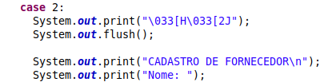
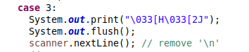
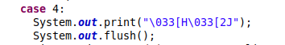
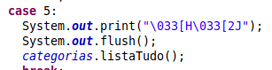
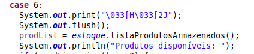
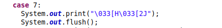

# TP2_SistemaEstoque

O TP2 consiste em realizar uma análise sobre o código, com base em boas características de um bom projeto de software, observar os maus-cheiros presentes no sistema e aplicar a operação de refatoração capaz de levar o projeto de código a ter a característica analisada.

## Integrantes 

| Discente | Matrícula |
|--------- | --------- |
| Leonardo Milomes Vitoriano | 201000379 |
| Cícero Barrozo Fernandes Filho | 190085819 |
| Christian Fleury Alencar Siqueira | 190011602 |

## Característica 1

### Ausência de duplicidades

- Descrição: característica crucial no desenvolvimento de software, frequentemente referida como o princípio DRY (Don't Repeat Yourself). Refere-se à prática de evitar a repetição desnecessária de código no programa. Isso significa que não deve haver cópias idênticas ou semelhantes de trechos de código ao longo do projeto. Em vez disso, as funcionalidades compartilhadas devem ser encapsuladas em funções, métodos, ou outros componentes reutilizáveis.
    
- Efeitos no código:
    - **Estrutura do Código**:<br>
        - **Organização**:
            Eliminação de código duplicado contribui para uma estrutura mais organizada. As funcionalidades são encapsuladas em funções ou módulos específicos, facilitando a compreensão do código.<br>
        - **Modularidade**:
            Módulos ou funções específicas podem ser reutilizadas em diferentes partes do código, promovendo uma arquitetura mais modular e flexível.
    - **Claridade**:
        - **Legibilidade**:
            Sem duplicidades, o código é mais conciso e fácil de ler. Desenvolvedores podem entender a lógica sem se perder em repetições desnecessárias.
        - **Compreensão**:
            A ausência de duplicações reduz a complexidade do código, tornando-o mais fácil de entender para desenvolvedores novos ou para revisões futuras.
    - **Coesão**:
        - **Foco na Responsabilidade**:
            Cada módulo ou função desempenha uma responsabilidade específica, resultando em alta coesão. Isso facilita a manutenção e modificação de partes isoladas do sistema.<br>
        - **Evita Ambiguidades**:
            Duplicações muitas vezes introduzem ambiguidades, pois alterações em um local podem ser esquecidas em outro. A ausência de duplicidades garante que a funcionalidade seja claramente definida em um único local.
    - **Acoplamento**:<br>
        - **Desacoplamento**:
            Reduzir duplicidades frequentemente leva a uma menor dependência entre diferentes partes do código. Isso resulta em um código mais desacoplado, onde alterações em uma parte do sistema têm menos impacto em outras.<br>
        - **Facilita Manutenção**:
            Alterações em uma parte do código, devido à ausência de duplicidades, têm menos probabilidade de afetar áreas não relacionadas, facilitando a manutenção do sistema.

### Relação com maus-cheiros


- **Boa Prática**: Ausência de Duplicidades
    - Efeitos Positivos no Código:
        Melhora a legibilidade, facilita a manutenção, reduz a ambiguidade, promove a coesão e desacopla componentes, entre outros benefícios.

- **Mau Cheiro**: Código Duplicado
    - Descrição:
        Refere-se à presença de trechos de código idênticos ou muito semelhantes em diferentes partes do sistema, o que pode levar a problemas de manutenção, introdução de bugs e dificuldades na evolução do software.
    - Efeitos Negativos no Código:
        Dificulta a compreensão, aumenta a probabilidade de inconsistências, torna o código mais propenso a erros e aumenta o esforço de manutenção.

A boa prática "Ausência de Duplicidades" visa eliminar ou reduzir a duplicação de código, enquanto o mau cheiro "Código Duplicado" identifica explicitamente a presença desse problema.

### Operação de refatoração


Na classe App.java, aonde está toda a lógica de integração do sistema, existem códigos duplicados, que podem ser visualizados a seguir:


 <br>
 <br>
 <br>
 <br>
 <br>
 <br>


A operação de refatoração a ser aplicada é:

- **Extrair método**: quando a mesma expressão encontra-se em dois métodos na mesma classe. 

Portanto, para alcançar a Característica 1, é necessário extrair o método, substituindo as ocorrências das repetições pelo método, e o código em Java que resolve isso encontra-se abaixo:


```java
private static void limpaTela() {
    System.out.print("\033[H\033[2J");
    System.out.flush();
}
```


## Característica 2

### Elegância

- Descrição: refere-se à qualidade estética, simplicidade e eficiência de sua implementação. Um código elegante é aquele que atinge seus objetivos de maneira concisa, fácil de entender e que utiliza abstrações apropriadas.
    
- Efeitos no código:
    - **Estrutura Clara e Simples**:
        A elegância promove uma estrutura clara e simples. O código é organizado de maneira lógica, com divisões adequadas em funções, classes ou módulos. Isso facilita a navegação e compreensão.
    - **Claridade na Expressão**:
        Um código elegante expressa suas intenções de maneira clara. O uso de nomes significativos para variáveis, métodos e classes contribui para uma compreensão rápida do propósito de cada elemento.
    - **Coesão Adequada**:
        A elegância favorece a coesão, onde partes relacionadas do código estão agrupadas de forma lógica. Classes e métodos têm responsabilidades bem definidas, o que melhora a manutenção e compreensão do sistema.
    - **Baixo Acoplamento**:
        Um código elegante geralmente possui baixo acoplamento entre seus componentes. Isso significa que as diferentes partes do código são independentes umas das outras, facilitando modificações e reduzindo os impactos colaterais.

### Relação com maus-cheiros


- **Boa Prática**: Elegância
    - Efeitos Positivos no Código:
        - Estrutura clara e simples.
        - Clareza na expressão das intenções.
        - Coesão adequada entre partes do código.
        - Baixo acoplamento entre componentes.
        - Eficiência e simplicidade na execução de tarefas.
        - Uso adequado de abstrações.

- **Mau Cheiro**: Instruções Switch
    - Descrição:
        Refere-se ao uso excessivo de instruções switch ou case em um código, especialmente quando essa estrutura cresce e se torna difícil de manter.
    - Efeitos Negativos no Código:
        - Complexidade aumentada com o crescimento do número de casos.
        - Dificuldade em manter e entender a lógica do código.
        - Potencial para introduzir erros durante modificações.
        - Baixa extensibilidade e flexibilidade.


Instruções switch frequentemente resultam em códigos extensos, difíceis de manter e entender, especialmente quando há muitos casos. Essa abordagem não é elegante, pois não favorece a simplicidade e clareza.

Uma prática mais elegante seria substituir instruções switch por abordagens mais polimórficas, como o uso de interfaces, classes abstratas ou padrões de design que favoreçam o polimorfismo. Isso não apenas reduz a complexidade, mas também torna o código mais extensível e fácil de manter.

### Operação de refatoração

Na classe App.java, aonde está toda a lógica de integração do sistema, existe uma instrução switch com mais de 6 *cases*, e cada *case* possui várias linhas de código, tornando difícil o compreendimento.

Sendo assim, a operação de refatoração aplicável seria:
- Extrair método / Mover método: para extrair todo o comando switch e movê-lo para onde o polimorfismo é necessário. 

Utilizando uma Hierarquia de Classes e Polimorfismo, é possível aplicar esses 3 passos a seguir para tornar o switch-case da classe App.java elegante, em pseudocódigo:

1. Criar uma interface para representar as opções do menu:

```java
public interface OpcaoMenu {
    void executar(Scanner scanner);
}
```

2. Implementar classes para cada opção do menu:

```java
public class CadastroCategoria implements OpcaoMenu {
    @Override
    public void executar(Scanner scanner) {
        // ...
    }
}

public class CadastroFornecedor implements OpcaoMenu {
    @Override
    public void executar(Scanner scanner) {
        // ...
    }
}

// ... Implementar classes para as demais opções do menu

```

3. Modificar a classe App para usar polimorfismo:

```java
public class App {
    // ... código

    public static void main(String[] args)
            throws ValorInvalidoException, DescricaoEmBrancoException, DuplicadoException {
        Scanner scanner = new Scanner(System.in);
        // ... Restante do código

        while (true) {
            menu();
            int option = scanner.nextInt();

            OpcaoMenu opcaoMenu = obterOpcaoMenu(option);
            opcaoMenu.executar(scanner);
        }
    }

    private static OpcaoMenu obterOpcaoMenu(int option) {
        switch (option) {
            case 1:
                return new CadastroCategoria();
            case 2:
                return new CadastroFornecedor();
            // ... Adicionar casos para as demais opções do menu
        }
    }

    // ... 
}


```

Então, depois de aplicar a operação de refatoramento, a classe App estaria mais elegante com a instrução switch-case devidamente refatorada, mais legivel e de fácil entendimento.

## Característica 3

### Simplicidade

- Descrição: A "Simplicidade" no código refere-se à prática de manter a implementação tão direta e clara quanto possível. Um código simples é fácil de entender, manter e modificar. 
    
- Efeitos no código:
    - Estrutura Clara:
        - Organização lógica e intuitiva de módulos, funções e classes.
        - Facilita a navegação e compreensão do código.
    - Clareza na Expressão:
        - Nomes de variáveis, métodos e classes são descritivos, facilitando a compreensão das intenções do código.
    - Coesão Adequada:
        - Classes e métodos têm responsabilidades bem definidas.
        - Aumenta a manutenibilidade, pois as mudanças afetam menos áreas do código.
    - Baixo Acoplamento:
        - Efeitos no Código:
            Componentes são independentes, facilitando modificações sem impacto em outras partes do sistema.
            Melhora a testabilidade do código.


### Relação com maus-cheiros

A simplicidade no código busca métodos curtos e concisos, enquanto o mau cheiro de "Método Longo" aponta para a presença de métodos que violam essa prática.

Métodos longos podem ser simplificados pela quebra em métodos menores, cada um realizando uma única tarefa. Isso não apenas torna o código mais claro, mas também facilita a manutenção e compreensão do sistema.

A fragmentação de lógica complexa em métodos menores alinha-se com a busca pela simplicidade. Cada método curto pode ser compreendido de maneira mais rápida e, quando nomeado de forma significativa, expressa claramente sua funcionalidade.

### Operação de refatoração


No Sistema de Estoque, na classe Estoque.java, existe a funcionalidade que alerta se o Produto está próximo da data de validade, chamado alertaProdutoProximoDaValidade, ou seja se o produto está quase inconsumível. O código do respectivo método encotra-se logo abaixo:

```java

// Verifica se a data de validade é até 15 dias próximos da data atual e manda alerta
  public boolean alertaProdutoProximoDaValidade() {
    Date hoje = new Date();

    Calendar dataAtual = Calendar.getInstance();
    dataAtual.setTime(hoje);

    dataAtual.add(Calendar.DAY_OF_MONTH, 15);

    for (Produto p : listaProduto) {
      Date dataValidade = p.getDataValidade();
      if (dataValidade != null) {
        Calendar dataValidadeCal = Calendar.getInstance();
        dataValidadeCal.setTime(dataValidade);

        if (dataValidadeCal.before(dataAtual) || dataValidadeCal.equals(dataAtual)) {
          return true;
        }
      }
    }
    return false;
  }
```

Como pode-se observar, esse método pode ser considerado longo pois ele possui mais de uma responsabilidade, portanto é necessário:

- Separar a lógica de cálculo da data atual e a verificação de proximidade da data de validade em métodos separados, o que aumentará a modularidade.

As operações de refatoração aplicáveis são:
- Extrair método: sempre que necessário diminuir o tamanho de um método.
- Decompor condicional: sempre que lidar com expressões condicionais e loops.   

```java
    public boolean alertaProdutoProximoDaValidade() {
        LocalDate dataAtual = LocalDate.now().plusDays(15);

        for (Produto p : listaProduto) {
            if (estaProximoDaValidade(p.getDataValidade(), dataAtual)) {
                return true;
            }
        }
        return false;
    }

    private boolean estaProximoDaValidade(LocalDate dataValidade, LocalDate dataAtual) {
        return dataValidade != null && !dataValidade.isAfter(dataAtual);
    }
```

Dessa forma, é possível alcançar a Característica 3, pois o método alertaProdutoProximoDaValidade continua tem a mesma funcionalidade, mas agora está mais simples, modularizado e legível. 


## Característica 4

### Portabilidade

- Descrição: A portabilidade significa que o código é preparado para rodar em diferentes ambientes.
    
- Efeitos no código:
    - Abstração de Plataforma:
        - Introdução de abstrações para manipulação de operações específicas da plataforma.
    - Padrões de Codificação Universais:
        - Adaptação do código para seguir convenções amplamente aceitas.
    - Detecção Dinâmica de Recursos:
        - Introdução de lógica condicional para detectar características da plataforma em tempo de execução.

### Relação com maus-cheiros

A falta de portabilidade pode gerar maus-cheiros de código como duplicação de código para atender plataformas diferentes, lógicas dependentes de sistema operacional, resultando em condicionais excessivas.

### Operação de refatoração
Considere o seguinte código Typescript, onde é feito um envio de email, e são utilizados templates, que estão no path "../emails/templates", no primeiro código, o path está sendo passado exatamente dessa forma, porém, esse código não é portável, pois nem todos sistemas operacionais entenderiam esse path, no Windows, por exemplo, seria "..\emails\templates".
```typescript
 private async renderEmail<T extends Record<string, any>>(
    input: IInputRenderEmail<T>
  ): Promise<Either<IError, string>> {
    try {
      const edge = new Edge({ cache: false })

      const templatesPath = '../emails/templates'

      edge.mount('templates', templatesPath)

      const htmlRendering = await edge.render(`templates::${input.template}`, input.payload)

      return right(htmlRendering)
    } catch (err) {
      console.log(err)
      return left(GeneralEmailServiceError)
    }
  }
```
Para resolver esse problema foi feito a seguinte refatoração, visando a portabilidade do código, onde utilizamos o módulo do javascript "path", e conseguimos construir o path em tempo de execução, de acordo com o sistema operacional em que o código está rodando. Esse código é portavel, rodando em diferentes sistemas operacionais corretamente.

```typescript
  import path from 'path'

  private async renderEmail<T extends Record<string, any>>(
    input: IInputRenderEmail<T>
  ): Promise<Either<IError, string>> {
    try {
      const edge = new Edge({ cache: false })

      const templatesPath = path.resolve(__dirname, '..', 'emails', 'templates')

      edge.mount('templates', templatesPath)

      const htmlRendering = await edge.render(`templates::${input.template}`, input.payload)

      return right(htmlRendering)
    } catch (err) {
      console.log(err)
      return left(GeneralEmailServiceError)
    }
  }

```

## Característica 5

### Modularidade (baixo acoplamento e alta coesão)

- Descrição: Modularidade refere-se à capacidade de dividir um sistema em partes independentes e coesas, permitindo baixo acoplamento entre elas. Isso significa que cada módulo ou componente deve realizar uma função específica e interagir com outros de forma mínima e bem definida, facilitando a manutenção, reutilização e escalabilidade do software.
    
- Efeitos no código:
    - Facilidade de Manutenção:
        -  Com módulos bem definidos, as alterações em um componente específico têm menos probabilidade de afetar outros, facilitando a manutenção e reduzindo o risco de introduzir erros em outras partes do código.
    - Reutilização de Código:
        - Módulos coesos podem ser facilmente reutilizados em diferentes partes do sistema ou em projetos distintos, economizando tempo de desenvolvimento e evitando a duplicação de código.
    - Testabilidade Aprimorada:
        - Módulos isolados e independentes são mais fáceis de testar, pois seu comportamento pode ser verificado de forma mais direta e específica, aumentando a cobertura de testes e a confiança na qualidade do software.
    - Escalabilidade:
        - Com uma arquitetura modular, é mais simples escalar o sistema, pois novos recursos ou funcionalidades podem ser adicionados sem grande impacto nos módulos existentes, permitindo o crescimento do software de maneira mais controlada e eficiente.


### Relação com maus-cheiros
O mau cheiro de código conhecido como "Cadeia de Mensagens" ocorre quando há uma sequência de chamadas de métodos ou acessos a propriedades de objetos, o que pode indicar um baixo nível de modularidade.

Relacionando com Modularidade:

Baixa Coesão: Cadeias de mensagens frequentemente indicam que um objeto está acessando diretamente muitos outros objetos para realizar suas tarefas. Isso sugere uma baixa coesão, pois a responsabilidade de uma parte do código está estendida por múltiplos objetos, o que pode dificultar a manutenção e a compreensão do código.

Alto Acoplamento: Esse mau cheiro geralmente está relacionado a um alto acoplamento entre objetos, já que a mudança em um objeto da cadeia pode exigir ajustes em todos os objetos subsequentes, impactando áreas aparentemente não relacionadas.

Dificuldade de Teste e Refatoração: Cadeias de mensagens dificultam a escrita de testes eficazes, pois é complicado isolar e testar cada parte da cadeia separadamente. Além disso, refatorar código com cadeias de mensagens pode ser desafiador, pois uma pequena alteração em um ponto da cadeia pode ter efeitos colaterais em vários outros lugares.

### Operação de refatoração

Pode-se notar no código do sistema de estoque, no App.java, que o método de cadastrar produto, assim como todos os outros métodos do switch, poderiam ser refatorados para métodos externos que só fossem chamados no menu, aumentando a modularização e deixando o código mais limpo, vamos ao código como está hoje:

```java
case 3:
          System.out.print("\033[H\033[2J");
          System.out.flush();
          scanner.nextLine(); // remove '\n'
                              //
          System.out.print("CADASTRO DE PRODUTO\n");
          
          System.out.print("Nome: ");
          String nomeProd = scanner.nextLine();
          System.out.print("Descrição: ");
          String descricao = scanner.nextLine();
          System.out.print("Código de barras: ");
          String codigoBarras = scanner.nextLine();
          System.out.print("Preço (Custo): ");
          float precoCusto = scanner.nextFloat();
          System.out.print("Preço (Venda): ");
          float precoVenda = scanner.nextFloat();
          System.out.print("Quantidade: ");
          int qtdDisponivel = scanner.nextInt();
          int idFornecedor = 1;
          System.out.print("Ano do vencimento: ");
          int dataA = scanner.nextInt();
          System.out.print("Mês do vencimento: ");
          int dataM = scanner.nextInt();
          //scanner.nextLine(); // remove '\n'

          Date dataValidade = new Date();
          dataValidade.setMonth(dataM);
          dataValidade.setYear(dataA);

          Produto p = new Produto(nomeProd, descricao, codigoBarras,
              precoCusto, precoVenda, qtdDisponivel, fornecedoresDb.listarFornecedores().get(0), dataValidade);
          estoque.armazenaProduto(p);
          System.out.print("PRODUTO CADASTRADO!\n");
          break;
```

É apenas um item do menu, modularizando para uma nova classe CadastraProduto por exemplo, teriamos o seguinte: 

```java
import java.util.Date;

public class CadastroProduto {
    private Estoque estoque;
    private Fornecedores fornecedoresDb;

    public CadastroProduto(Estoque estoque, Fornecedores fornecedoresDb) {
        this.estoque = estoque;
        this.fornecedoresDb = fornecedoresDb;
    }

    public void cadastrarNovoProduto(Scanner scanner) {
        System.out.print("CADASTRO DE PRODUTO\n");

 
        Produto p = criarProdutoComInformacoesColetadas();
        estoque.armazenaProduto(p);
        System.out.print("PRODUTO CADASTRADO!\n");
    }

    private Produto criarProdutoComInformacoesColetadas() {
         return new Produto(/* informações do produto */);
    }
}
```
E o código main teria apenas esse trecho

```java
 case 3:
            System.out.print("\033[H\033[2J");
            System.out.flush();
            cadastroProduto.cadastrarNovoProduto(scanner);
            break;

```
tornando a leitura mais fácil e o código ficaria mais dividido.

